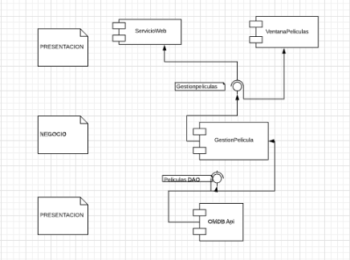
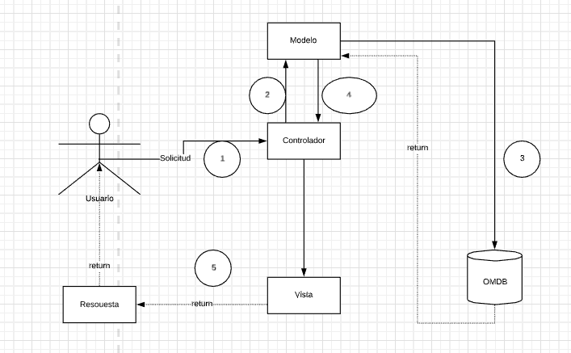
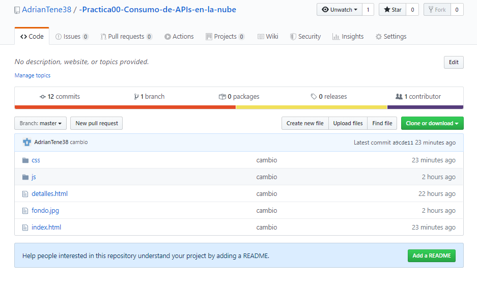
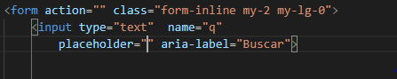
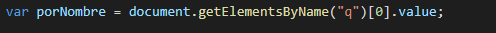
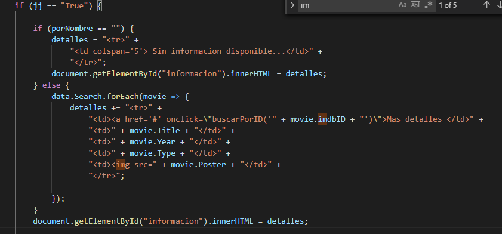
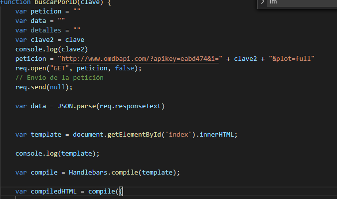
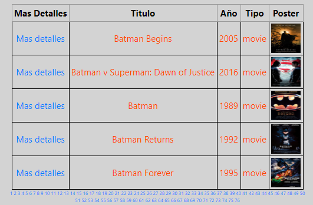
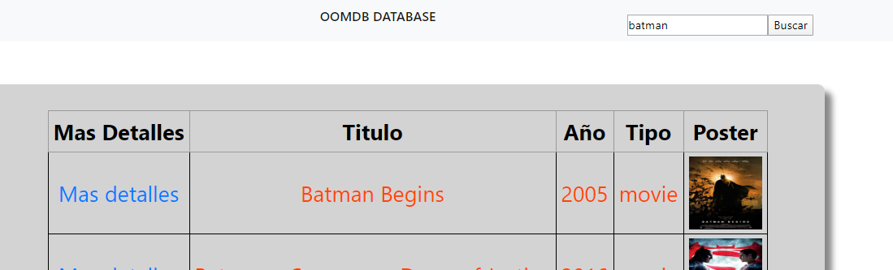
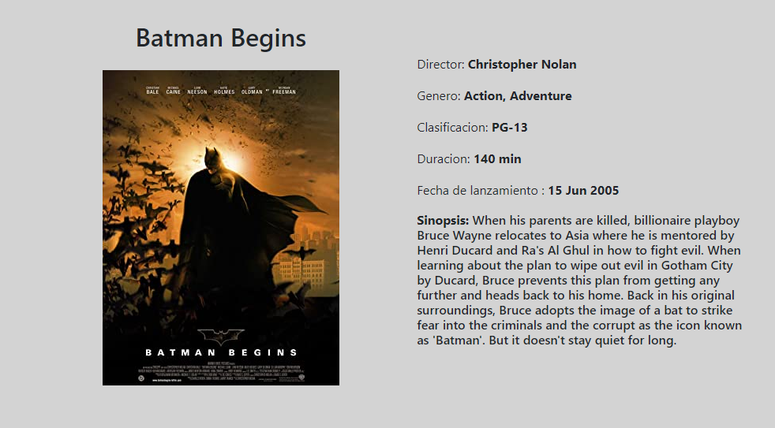

Nombre: Adrian Tene

| Identificar gráficamente la arquitectura y el patrón de diseño de la aplicación a desarrollar. |
|------------------------------------------------------------------------------------------------|

>   Arquitectura

>   Patron

>   Patrones:

>   1.- El usuario envia la solicitud de petición al servidor.

>   2.- El controlador se he encarga de leer la perticion del usuario, y le
>   solicita al modelo.

>   3.- El modelo se comunica con la base de datos donde este le envía la
>   solicitud realizada

>   4.-El modelo envia estos datos al controlador

>   5.- El controlador recibe la información a la vista, y la vista se encarga
>   de mostrar los datos que el al cliente solicito

| Generar una llave para consumir los servicios web de la API de OMDb. "http://www.omdbapi.com/?apikey=eabd474&s="                                                                                                                                                                                         |   |   |   |   |   |   |   |   |   |   |
|----------------------------------------------------------------------------------------------------------------------------------------------------------------------------------------------------------------------------------------------------------------------------------------------------------|---|---|---|---|---|---|---|---|---|---|
| Crear un repositorio en GitHub con el nombre “Practica00 – Consumo de APIs en la nube”                                                                                                                                                                                                                   |   |   |   |   |   |   |   |   |   |   |
| La aplicación Web debe permitir buscar la información de las películas tanto por el nombre (listado) como por el código (id) de cada película. Se recupera el nombre de la película a buscar y se le envia a java script donde realizara la búsqueda de la película por el nombre que el usuario digite. |   |   |   |   |   |   |   |   |   |   |
| Además, se deberá visualizar toda la información disponible (plot=full) de la base de datos de películas.                                                                                                                                                                                                |   |   |   |   |   |   |   |   |   |   |
| También, la aplicación deberá presentar un máximo de 5 películas por búsqueda. Es decir, si la búsqueda retorna más de 5 películas se deberá paginar los resultados. La página se encuentra paginizada y realiza la búsqueda de 5 películas.                                                             |   |   |   |   |   |   |   |   |   |   |
| Por último, la interfaz gráfica de aplicada debe ser intuitiva y sencilla aplicando conceptos de experiencia de usuario. En la pagina realizada se ingresa el nombre de la película que el usuario solicita                                                                                              |   |   |   |   |   |   |   |   |   |   |

JavaScript

>   Para lograr este punto de la practica se realiza el siguiente método donde
>   básicamente es verificar si la página existe, dicho esto se le pasa a la
>   petición y realiza la búsqueda de películas.

>   MAS DETALLES

Si el usuario quiere obtener un poco mas de información de la película, oprime
mas detalles y obtiene el resultado.

